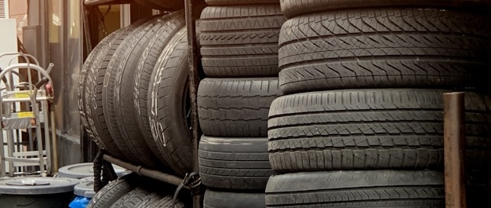

# Anwendungsbeispiel 1: Effiziente Tourenplanung für Automobilteile-Zulieferer

!(autoteile_lieferlogistik.jpg "Routenoptimierung für die schnelle Lieferung von Kfz-Ersatzteilen an Werkstätten")

Photo by <a href="https://unsplash.com/@jontyson?utm_content=creditCopyText&utm_medium=referral&utm_source=unsplash">J MB</a> on <a href="https://unsplash.com/de/fotos/schwarz-silberner-motorradmotor-mj_VRSoe5t4">Unsplash</a>

## Szenario: Tägliche Herausforderungen in der Ersatzteillogistik

Ein regionaler Automobilteile-Zulieferer beliefert täglich eine Vielzahl von Kfz-Werkstätten und Teilehändlern. Die Herausforderung liegt in der hohen Anzahl an Stopps, oft mit kurzfristigen Bestellungen und engen Zeitfenstern, die von den Werkstätten vorgegeben werden (z.B. für laufende Reparaturen). Die Teilevielfalt reicht von Kleinteilen bis zu sperrigen Karosserieelementen. Pünktlichkeit und Zuverlässigkeit sind entscheidend für die Kundenzufriedenheit. Eine manuelle Routenplanung für die 15-köpfige Lieferflotte ist extrem zeitaufwendig und führt oft zu ineffizienten Routen und hohen Kosten.

## Lösung: Präzise Planung mit MultiRoute Tour! für den Teilehandel

MultiRoute Tour! ist die ideale Softwarelösung, um die spezifischen Anforderungen der Automobilteile-Logistik zu meistern:

1.  **Schneller Datenimport für tagesaktuelle Aufträge**: Exportieren Sie Ihre täglichen Lieferaufträge (Adressen, Kundennamen, etc.) einfach aus Ihrem Warenwirtschafts- oder CRM-System als Excel-Datei. Ergänzen Sie problemlos wichtige Details wie vorgegebene Lieferzeitfenster der Werkstätten, spezielle Anlieferungshinweise oder die geschätzte Entlade-/Aufenthaltsdauer.

    *Beispiel für eine Importdatei mit Werkstatt-Zeitfenstern:*

    | Straße Hausnummer | PLZ  | Ort        | Kundenname (Werkstatt) | Lieferzeitfenster Start | Lieferzeitfenster Ende | Aufenthaltsdauer (Sek.) | Anmerkung          |
    |------------------|------|------------|------------------------|-------------------------|------------------------|-------------------------|--------------------|
    | Industriestraße 5 | 80331| München    | Kfz-Service Müller     | 08:00                   | 10:00                  | 600                     | Dringend, Hebebühne 2 |
    | Werkstraße 12     | 80331| München    | AutoFit Weber          | 09:30                   | 11:30                  | 900                     |                    |
    | Hauptstraße 22    | 80331| München    | TeileProfi Süd         | 10:00                   | 13:00                  | 1200                    | Laderampe nutzen   |
    | Westendstraße 44  | 80331| München    | Schnell-Reparatur GmbH | 08:00                   | 09:30                  | 600                     | Kleine Teile       |

2.  **Intelligente Routenberechnung & Ressourcenzuweisung**: Legen Sie fest, welche Fahrzeuge (mit ggf. unterschiedlichen Ladekapazitäten) und Fahrer verfügbar sind. MultiRoute Tour! berechnet unter Berücksichtigung aller Zeitfenster, Pausenzeiten und der Verkehrslage die optimalen Routen für jedes Fahrzeug. Der Algorithmus minimiert die gefahrenen Kilometer und die Gesamtzeit, stellt die Einhaltung der Lieferzusagen sicher und maximiert die Anzahl der möglichen Stopps pro Tour.

**Ergebnis:** Deutlich reduzierte Planungszeit, niedrigere Kraftstoffkosten, höhere Pünktlichkeit bei Werkstattlieferungen und somit eine verbesserte Wettbewerbsfähigkeit und Kundenzufriedenheit im anspruchsvollen Automotive Aftermarket.
