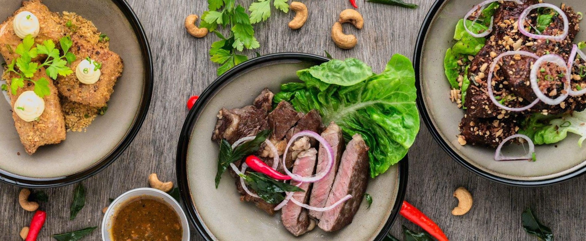

# Essen auf Rädern: Effiziente Routenplanung für Ihre Essenslieferungen

Photo by <a href="https://unsplash.com/@lvnatikk?utm_source=unsplash&utm_medium=referral&utm_content=creditCopyText">Lily Banse</a> on <a href="https://unsplash.com/s/photos/meal?utm_source=unsplash&utm_medium=referral&utm_content=creditCopyText">Unsplash</a>

## Szenario: Regelmäßige Essenslieferungen optimal planen

Sie beliefern regelmäßig Kunden mit warmen Mittagessen. Zu Ihren Hauptkunden zählen Senioren und Seniorenheime, die täglich zwischen 11:30 und 13:30 beliefert werden. Sie bieten drei verschiedene Gerichte an:

* **Suppe des Tages** (vegetarisch)
* **Einfaches Menü** (Hauptgericht + Beilage)
* **Premiummenü** (Exklusives Hauptgericht + Beilage + Dessert)

Ihre drei Fahrzeuge sollen so effizient wie möglich eingesetzt werden, um die Lieferungen pünktlich und das Essen warm zuzustellen.

## MultiRoute Tour!: Ihre Lösung für effiziente Essenslieferungen

MultiRoute Tour! bietet Ihnen verschiedene Optionen, um Ihre Routenplanung zu optimieren:

* Exportieren Sie die täglichen Bestellungen aus Ihrem CRM als Excel-Liste. Diese sollte die Adressinformationen sowie das gewählte Menü (1, 2 oder 3) enthalten.
* Planen Sie die Lieferungen in zwei Schichten: 11:30-12:30 Uhr und 12:30-13:30 Uhr, um sicherzustellen, dass das Essen warm ankommt.
* Hinterlegen Sie die Wunschlieferzeiten Ihrer Kunden. Sie können die Lieferzeitfenster je nach Bedarf anpassen. Beachten Sie jedoch, dass nicht alle Kunden gleichzeitig beliefert werden können.

Beispiel für die Excel-Liste:

|Straße Hausnummer|PLZ|Ort|Menü-Notizen|Lieferzeitfenster Start|Lieferzeitfenster Ende|
|-----------------|---|---|------------|----------------------|--------------------|
|Hauptstraße 10|21614|Buxtehude|1|11:30|12:00|
|Bahnhofsweg 11|21614|Buxtehude|1|11:45|12:30|
|Amselgasse 20|21614|Buxtehude|3|12:45|13:15|
|Eichenweg 33|21614|Buxtehude|2|12:30|13:30|

MultiRoute Tour! berechnet nun automatisch sechs verschiedene Routen für Ihre Flotte von drei Fahrzeugen und zwei Schichten, wobei die angegebenen Lieferzeitfenster berücksichtigt werden. Exportieren Sie die Excel-Listen für die jeweiligen Schichten und geben Sie diese an die Küche weiter, die die Menüs entsprechend vorbereitet.

Dieses Szenario eignet sich auch ideal für die Essensbelieferung in Kindergärten, Schulen und ähnlichen Einrichtungen.

Die Fahrer erhalten den [Google-Maps-Export](../tour/#tour-exportieren) und können die Route direkt mit ihrem Handy navigieren.

---
