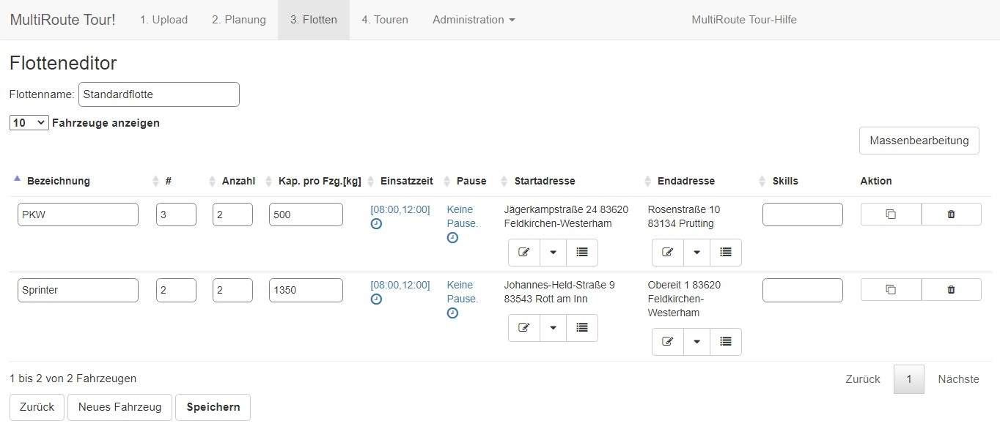
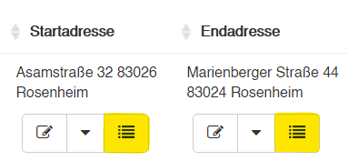
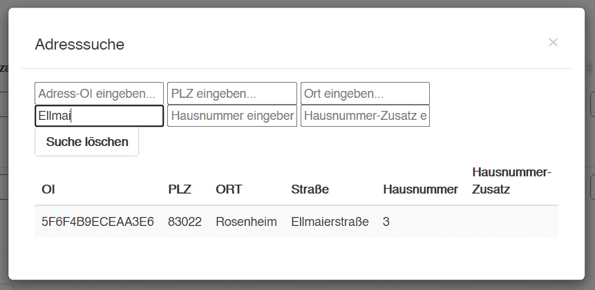

# **3. Flotten**

In den Flotten legen Sie fest, welche Fahrzeuge Sie im Einsatz haben.

## Fahrzeugparameter

- Als **Bezeichnung** wird von den meisten Kunden entweder Fahrzeugtyp (PKW, LKW, Sprinter etc.), Kennzeichen (M-KR-2010) oder Fahrername (Thomas) gewählt. 
- Die Spalte mit der kleinen Raute, die sogenannte **Streckenzuordnung**, dient der Sortierung der Fahrzeuge. Diese können Sie in der Regel einfach ignorieren. 
- Die **Anzahl** gibt an, wie viele Fahrzeuge Sie von dem jeweiligen Typ zur Verfügung haben. MultiRoute Tour! wird Ihnen die Fahrzeuganzahl berechnen, die optimal ist, um möglichst wenige Kilometer zu fahren, d.h. es werden nicht automatisch alle Fahrzeuge die hier angegeben werden, genutzt.
- Die **Kapazität** gibt an, welches Fassungsvermögen in Stück oder kg der jeweilige Fahrzeugtyp hat.
- Die **Einsatzzeit** können Sie beliebig anpassen. 
- Bei **Pausen** können Sie genau eine Pause berücksichtigen lassen, die sich innerhalb der Einsatzzeit befinden muss. Bspw. können Sie eine 60-minütige Pause zwischen 12 und 14 Uhr einbauen lassen. Diese 60 min werden vom Algorithmus automatisch optimal zugeteilt, frühestens bspw. 12-13 Uhr oder spätestens 13-14 Uhr.
- Die **Start- und Endadresse** können beliebig wählen. Die Adresse muss nur im System vorhanden sein und vorher entweder hochgeladen oder manuell gesetzt worden sein. Fehlt Ihre Adresse? Legen Sie sie einmalig im System an wie  [hier](../tipps/#adressen-neu-anlegen) erklärt. 
- Die **Skills** beziehen sich auf die Skills die Sie ggf. hochgeladen haben. Hier würde nun auch entsprechend "Kühlfahrzeug" oder "mit Hebebühne" angegeben werden. 
- In der **Aktionsspalte** können Sie den Fahrzeugtypen klonen oder löschen.

???+ Hinweis zu Tagen beim Zeitfenster

	MultiRoute Tour! geht per Default davon aus, dass alle Ihre Aufträge am gleichen Kalendertag bearbeitet werden. 
	Wenn Sie Aufträge in der Nacht erledigen oder Sie generell in längeren Schichten arbeiten, müssen Sie dies entsprechend sowohl bei den Auftragszeitfenstern im Upload, als auch beim Einsatzzeitfenster der Fahrzeuge kennzeichnen.
	Bsp.: Ein Auftrag kann zwischen 22:00 Uhr und 02:00 des Folgetages erledigt werden. 22:00 Uhr bezieht sich hierbei auf den Ausgangstag (Default), 02:00 Uhr auf den Folgetag. Das Einsatzzeitfenster der Fahrzeuge könnte bspw. 20:00 Uhr bis 04:00 Uhr des Folgetags betragen. Dies kennzeichnet sich in der Flotte mit "Tag 0 20:00 Uhr bis Tag 1 04:00 Uhr". 

## Start- und Endadresse definieren
    
Möchten Sie eine Start- oder Endadresse für die Fahrzeuge suchen, klicken Sie auf das Listensymbol (gelb markiert). 

Es öffnet sich eine Suchmaske in der Sie bspw. den Straßennamen eingeben. 

Wenn Sie auf die entsprechende Adresse klicken, ist diese eingetragen. Fehlt Ihre Adresse? Legen Sie sie einmalig im System an wie  [hier](../tipps/#adressen-neu-anlegen) erklärt. Vergessen Sie am Ende nicht, die Flotte zu speichern! 

