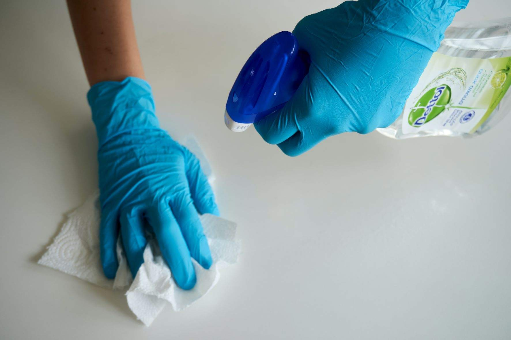

# Gebäudereinigung: Effektive Planung Ihrer Einsätze

Photo by <a href="https://unsplash.com/@uniqueton?utm_source=unsplash&utm_medium=referral&utm_content=creditCopyText">Anton</a> on <a href="https://unsplash.com/s/photos/cleaning?utm_source=unsplash&utm_medium=referral&utm_content=creditCopyText">Unsplash</a>

## Szenario: Optimierte Routen für Ihre Reinigungsteams

Ein Reinigungsunternehmen mit 10 Fahrzeugen und 2er-Teams plant wöchentlich seine Touren, um die Effizienz zu maximieren. Dabei gilt es, sowohl die Aufenthaltsdauer als auch die Fahrzeiten zu optimieren.

## Lösung mit MultiRoute Tour!: Zeit- und kostensparende Routenplanung

MultiRoute Tour! unterstützt Sie bei der effizienten Planung Ihrer Reinigungsaufträge:

* **Wöchentliche Planung**: Exportieren Sie die zu bearbeitenden Kunden aus Ihrem CRM als Excel-Liste. In der Tabelle können Sie Wochentag, gewünschte Besuchszeit, Aufenthaltsdauer und weitere Details festlegen.

Beispiel für eine Excel-Liste:

| Straße Hausnummer | PLZ  | Ort       | Kundenname  | Besuchszeitfenster Start | Besuchszeitfenster Ende | Aufenthaltsdauer (Sek.) | 
|------------------|------|-----------|-------------|--------------------------|-------------------------|-------------------------|
| Hauptstraße 10    | 21614| Buxtehude | Edeka       | 07:30                    | 12:30                   | 3600                    |
| Bahnhofsweg 11    | 21614| Buxtehude | Rossmann    | 10:30                    | 12:30                   | 3600                    |
| Amselgasse 20     | 21614| Buxtehude | Müller & co.| 11:30                    | 12:30                   | 3600                    |
| Eichenweg 33      | 21614| Buxtehude | Danny's     | 09:00                    | 10:30                   | 3600                    |

* **Fahrzeug- und Teamzuteilung**: Definieren Sie in Ihrer Flotte, welche Fahrzeuge und Teams an welchen Tagen zur Verfügung stehen. Mit diesen Informationen kann MultiRoute Tour! die optimalen Routen berechnen, um Fahrzeiten zu minimieren und die Produktivität zu maximieren.

* **Navigation und Export**: Die Fahrer erhalten den [Google-Maps-Export](../tour/#tour-exportieren) und können sofort mit ihrem Smartphone zur nächsten Adresse navigieren.

---

