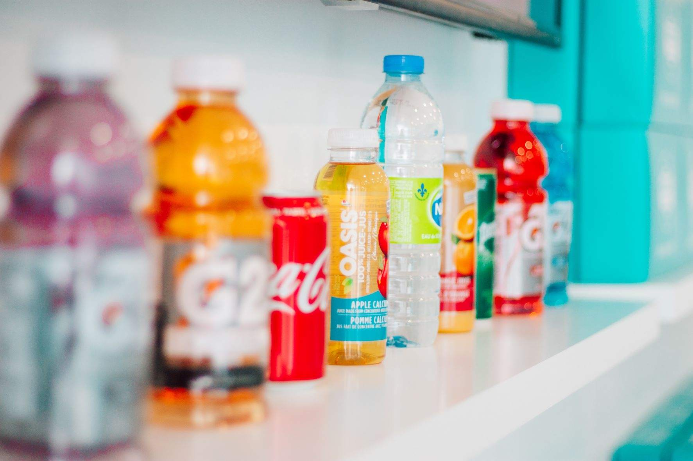

# Getränkelieferungen: Einfache Routenplanung mit MultiRoute Tour!

Photo by <a href="https://unsplash.com/@itsmaemedia?utm_source=unsplash&utm_medium=referral&utm_content=creditCopyText">Shayna Douglas</a> on <a href="https://unsplash.com/s/photos/beverages?utm_source=unsplash&utm_medium=referral&utm_content=creditCopyText">Unsplash</a>

## Szenario: Herausforderung in der Getränkelieferung

Als Getränkelieferdienst stehen Sie vor der Aufgabe, Ihre Touren möglichst effizient zu planen. Sie beliefern Großkunden, kleine Supermärkte und Gastronomiebetriebe, die oft spezielle Öffnungszeiten haben. Dabei möchten Sie Ihre Fahrzeuge optimal auslasten und die Lieferzeiten genau einhalten.

## Lösung mit MultiRoute Tour!: Maximale Effizienz bei der Auslieferung

MultiRoute Tour! bietet Ihnen die perfekte Lösung, um Ihre Getränkelieferungen effizient zu gestalten:

* Definieren Sie die Kapazitäten Ihrer Fahrzeuge mit einem kleinen Puffer, um flexibel auf Bestellmengen reagieren zu können.
* Exportieren Sie die täglichen Lieferaufträge aus Ihrem CRM als Excel-Liste. Diese Liste sollte die Adressinformationen, das Gewicht der Ladung und die gewünschten Lieferzeitfenster enthalten.

Beispiel für die Excel-Liste:

|Straße Hausnummer|PLZ|Ort|kg|Lieferzeitfenster Start|Lieferzeitfenster Ende|
|-----------------|---|---|---|----------------------|--------------------|
|Hauptstraße 10|21614|Buxtehude|100| | |
|Bahnhofsweg 11|21614|Buxtehude|700|11:45|12:30|
|Amselgasse 20|21614|Buxtehude|1000| | |
|Eichenweg 33|21614|Buxtehude|300|12:30|13:30|

* Nutzen Sie MultiRoute Tour!, um mit einem Klick die optimalen Touren für Ihre Flotte zu berechnen. Die Software berücksichtigt dabei sowohl die Fahrzeugkapazitäten als auch die Lieferzeitfenster.

Ihre Fahrer erhalten anschließend den [Google-Maps-Export](../tour/#tour-exportieren) und können die Route direkt mit ihrem Handy navigieren.

Dieses effiziente System sorgt dafür, dass Ihre Kunden pünktlich beliefert werden und die Getränke kühl bleiben – damit mehr Zeit für den Genuss bleibt.

---

