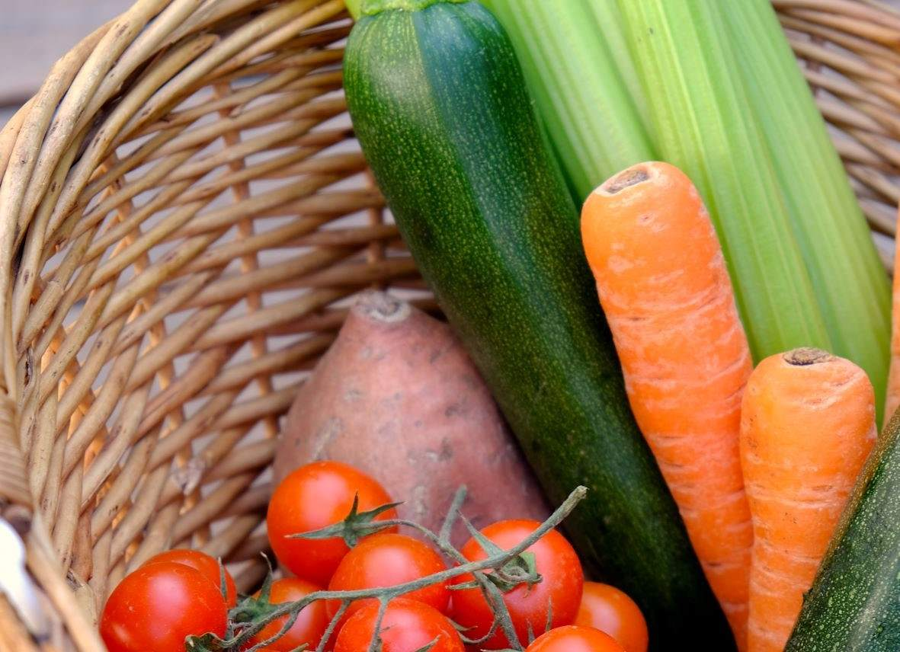

# Bio-Lieferkisten und mehr: Routenplanung leicht gemacht

Photo by <a href="https://unsplash.com/@sarascarpa?utm_source=unsplash&utm_medium=referral&utm_content=creditCopyText">Sara Scarpa</a> on <a href="https://unsplash.com/?utm_source=unsplash&utm_medium=referral&utm_content=creditCopyText">Unsplash</a>

## Szenario: Erfolgreiche Lieferung von Bio-Lieferkisten

Sie beliefern Ihre Kunden täglich oder wöchentlich mit regionalen Obst- und Gemüsekisten. Alle Kunden erhalten die gleiche Kiste, und Sie haben drei Fahrzeuge im Einsatz, die diese Lieferungen zuverlässig einmal pro Woche direkt vor die Haustür stellen.

## Lösung mit MultiRoute Tour!: Effiziente Auslieferung Ihrer Lieferkisten

MultiRoute Tour! ermöglicht es Ihnen, Ihre Routen für die tägliche oder wöchentliche Auslieferung Ihrer Bio-Lieferkisten effizient zu planen:

* Erfassen Sie die Anzahl der Kisten pro Haushalt sowie gewünschte Lieferzeitfenster in einer Excel-Liste, die Sie in MultiRoute Tour! hochladen können.

Beispiel für die Excel-Liste:

|Straße Hausnummer|PLZ|Ort|Anzahl|Lieferzeitfenster Start|Lieferzeitfenster Ende|
|-----------------|---|---|------|----------------------|----------------------|
|Hauptstraße 10|21614|Buxtehude|1| | |
|Bahnhofsweg 11|21614|Buxtehude|1|11:45|12:30|
|Amselgasse 20|21614|Buxtehude|2| | |
|Eichenweg 33|21614|Buxtehude|1|12:30|13:30|

* Optimieren Sie die Auslastung Ihrer Flotte, indem Sie die Touren mit einem Klick berechnen lassen. MultiRoute Tour! berücksichtigt dabei individuelle Kundenwünsche wie Ablageorte und Lieferzeitfenster.

Falls Sie die Lieferungen auf mehrere Tage aufteilen möchten, können Sie verschiedene Szenarien mit wenigen Klicks vergleichen und das beste Modell auswählen.

Ihre Fahrer erhalten den [Google-Maps-Export](../tour/#tour-exportieren) und können direkt mit der Navigation beginnen.

## Ähnliche Szenarien:

Auslieferung von Lebensmittelkisten für Supermärkte, Belieferung von Büros mit Obstkisten, Essen für Kindergärten oder Schulen, Brötchendienste etc.

---

