# **2. Planung**

## Bedienung
In der Planung können Sie sich Ihre Aufträge anzeigen lassen und diese bearbeiten.

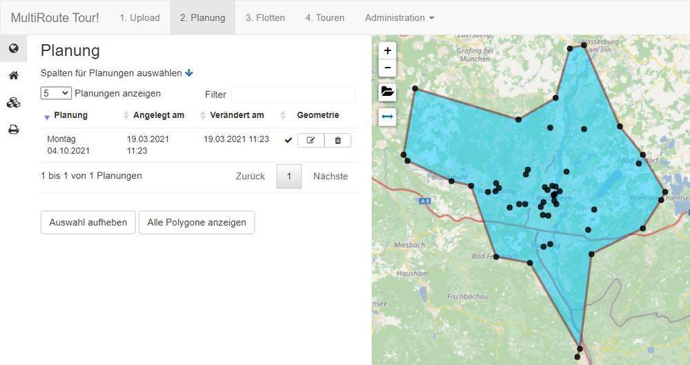{ loading=lazy }

Jeder schwarze Punkt ist eine Adresse. An den Adressen können Sie sich ansehen, in welcher Planung, d.h. an welchen Tagen (oder Wochen) Aufträge vorhanden sind. 

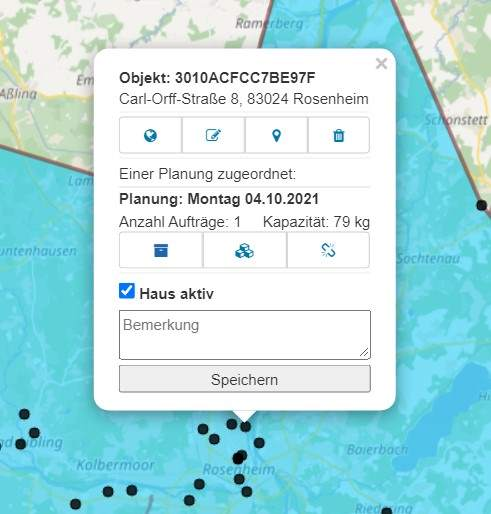{ loading=lazy }

Diese Aufträge können Sie mit einem Klick auf die drei Kistchen bearbeiten und nach Bedarf anpassen, sollte bspw. ein Kunde ausfallen oder sich ein Zeitfenster ändern. 

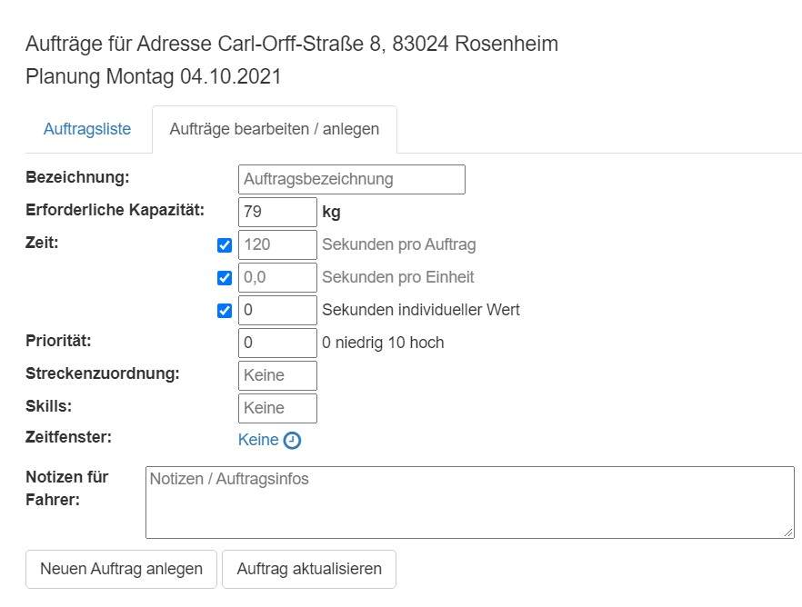{ loading=lazy }

## Adressverwaltung

Die Adressverwaltung befindet sich unter Planung in der linken Sidebar mit einem Klick auf das Haus-Symbol.

Hier können Ihre Adressen durchsucht werden. Gelöscht werden können diese nur durch den Administrator unter **Administration -> Upload**

Neue Adressen können durch den [Upload](../upload) oder [manuell per Klick in die Karte](../tipps/#adressen-neu-anlegen) hinzugefügt werden.

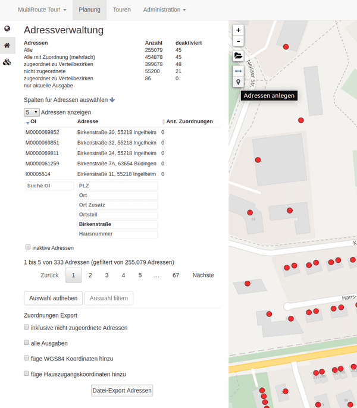

### Adressen korrigieren mit Google

Wenn es beim Hochladen Ihrer Datei Adressen gab, für die keine Koordinate gefunden werden konnte, können Sie diese ganz einfach mithilfe einer Suche über Google Maps korrigieren. 

1) Zeigen Sie sich unter **2.Planung -> Adressverwaltung (kleines Häuschen)** und einem Klick auf die Checkbox **Adressen ohne Koordinaten** alle Adressen an, die nicht korrigiert werden konnten.

2) Hier sehen Sie zwei kleine Buttons. Die Pinnadel sucht die Adresse direkt in der Karte. Kann diese hier nicht gefunden werden, suchen Sie Ihre Adresse mit einem Klick auf das Google-Icon. Dieser öffnet einen neuen Tab in Ihrem Browser und sucht Ihre Adresse. 

3) In Google Maps klicken Sie mit der rechten Maustaste auf den Punkt, wo Ihre Adresse liegt und kopieren sich mit einem Rechtsklick die Koordinate in den Zwischenspeicher.

4) In MRT! klicken Sie in der Spalte "OI" auf die entsprechende Adresse. Ein kleines Fenster öffnet sich, wo Sie nun die Koordinate mit STRG+V einfügen. Klicken Sie auf OK. Fertig! Die Koordinate ist nun für die Adresse übernommen worden und muss bei weiteren Uploads nicht noch einmal korrigiert werden. MultiRoute Tour! merkt sich die Koordinate also auch für die Zukunft.

## Auftragsverwaltung

### Sortieren

Die Aufträge können nach Bezeichnung, Adresse, Planung und Status (aktiv/inaktiv) gefiltert und mit einem Klick auf die Pfeile auf- oder absteigend sortiert werden. 

Mit einem Klick auf die Adresse in der jeweiligen Spalte zentriert sich die Karte auf die ausgewählte Adresse.

Wenn Sie auf den blauen Pfeil bei "Spalten für Adressen auswählen" klicken, können Sie sich weitere Spalten anzeigen lassen oder Spalten abwählen.

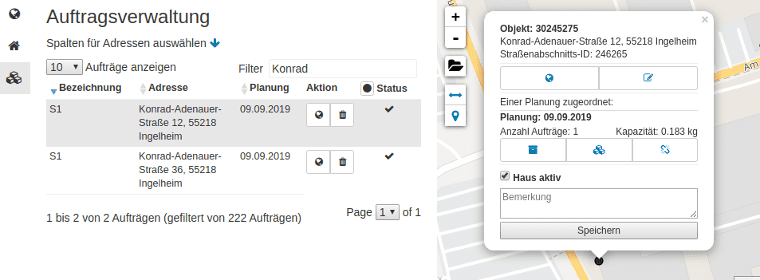

***

### Verschieben oder löschen

Möchten Sie einen Auftrag in eine andere Planung verschieben, klicken Sie in der Zeile mit dem gewünschten Auftrag in der Spalte **Aktion** auf die kleine Weltkugel. 

Es öffnet sich ein Popup-Fenster, in dem Sie nun nur noch die richtige Planung anklicken müssen. Über die Mülltonne ließe sich der ausgewählte Auftrag löschen.

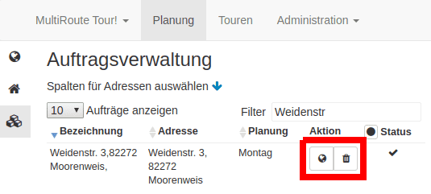 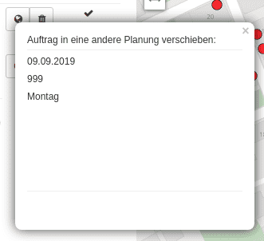

Sie können alternativ direkt in der Karte eine Adresse auswählen. Mit einem Klick auf den entsprechenden Punkt öffnet sich das Menü. Auch hier können Sie einfach auf die Weltkugel klicken und den Auftrag ebenso verschieben.

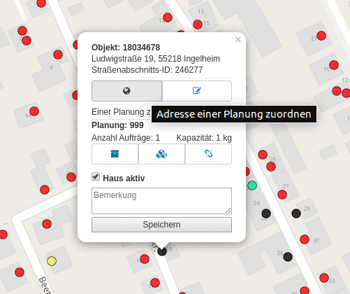

***

### Bearbeiten und neu anlegen

Wenn Sie Aufträge für eine Adresse bearbeiten oder neu anlegen möchten, klicken Sie auf das Symbol mit den drei Boxen in der Mitte des Menüs.

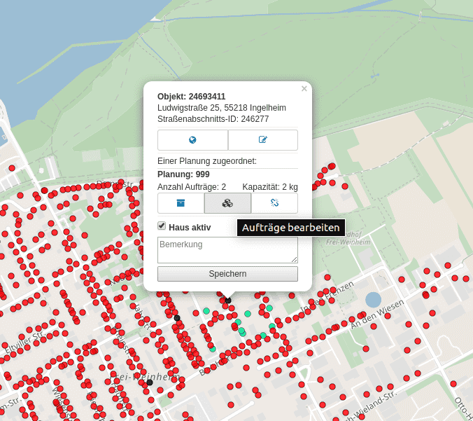

Daraufhin öffnet sich das Auftragsmenü.

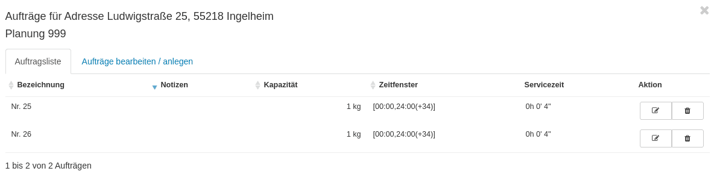

Hier legen Sie entweder einen neuen Auftrag an oder bearbeiten einen existierenden mit Klick auf die entsprechende Zeile.

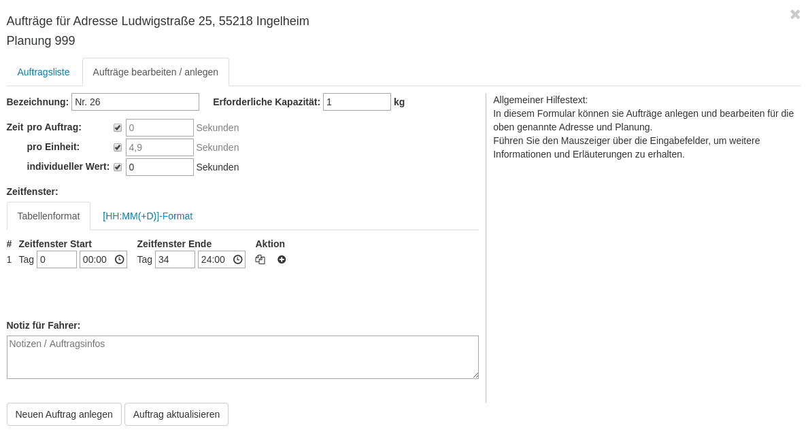

