# Tipps & Tricks 

## Adressen neu anlegen

In drei einfachen Schritten können Sie in MRT! neue Adressen anlegen. Dies ist nützlich wenn Sie bspw. die Start- und Endadresse der Fahrzeuge verändern möchten. 

1) Klicken Sie auf **2.Planung** und anschließend auf das kleine Häuschen in der linken Sidebar (Adressverwaltung). 

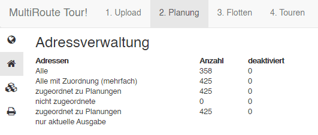

2) Suchen Sie oben rechts in der Karte nach der gewünschten Adresse und klicken Sie diese an. Die Karte springt zur entsprechenden Adresse.

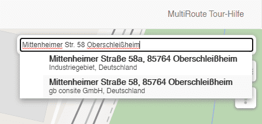

3) Klicken Sie in der Karte auf die Pinnadel (gelb markiert) und setzen Sie das Fadenkreuz auf das entsprechende Gebäude. Falls nötig passen Sie die Adressinfos an und klicken Sie auf speichern. 

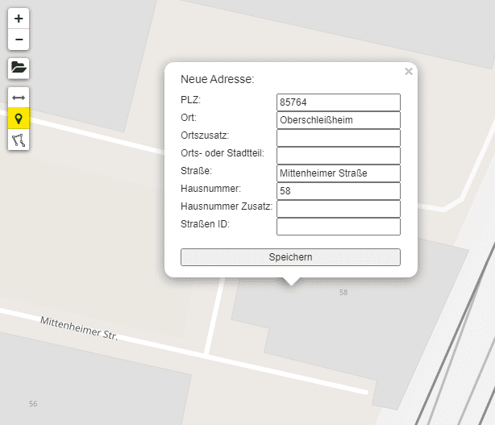

Fertig. Sie können diese Adresse nun in der Adressverwaltung finden und in der Flotte als Start- und Endadresse auswählen.

 

## Adressen umsetzen 

Wenn Sie feststellen, dass eine Adresse nicht optimal gesetzt wurde, können Sie diese jederzeit umsetzen. 

Dies ist z.B. bei großen Fabrikgeländen oder Hintereingängen nützlich, sodass die Fahrer direkt zum richtigen Eingang navigiert werden. 

1) Klicken Sie unter **2. Planung** auf den gewünschten Punkt auf der Karte. Es öffnet sich ein kleines Popup. Klicken Sie auf die Pinnadel (gelb markiert).

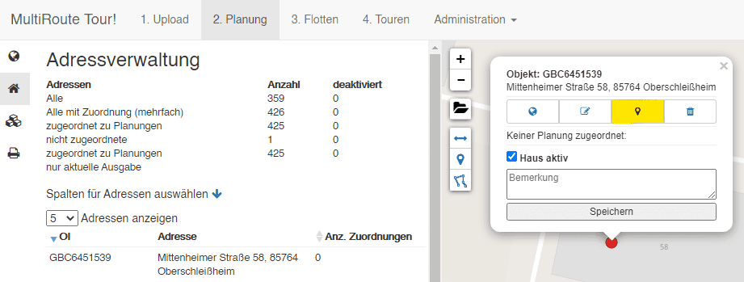

2) Setzen Sie die die Adresse nun mit dem Fadenkreuz auf die richtige Stelle. Falls Sie exakte Koordinaten eingeben möchten, können Sie dies hier tun, ansonsten speichern Sie lediglich.

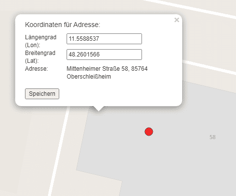

Fertig. Die Adresse ist umgesetzt. Bei weiteren Uploads bleibt diese Adresse auch für die Zukunft umgesetzt, wenn Sie sie nicht löschen. 

 

## Adressen korrigieren mit Google Maps

Wenn es beim Hochladen Ihrer Datei Adressen gab, für die keine Koordinate gefunden werden konnte, können Sie diese ganz einfach mithilfe einer Suche über Google Maps korrigieren. 

1) Zeigen Sie sich unter **2.Planung -> Adressverwaltung (kleines Ordnersymbol)** und einem Klick auf die Checkbox **"Adressen ohne Koordinaten"**alle Adressen an, die nicht korrigiert werden konnten.

2) Hier sehen Sie zwei kleine Buttons. Die Pinnadel sucht die Adresse direkt in der Karte. Kann diese hier nicht gefunden werden, suchen Sie Ihre Adresse mit einem Klick auf das Google-Logo. Dieser öffnet einen neuen Tab in Ihrem Browser und sucht Ihre Adresse. 

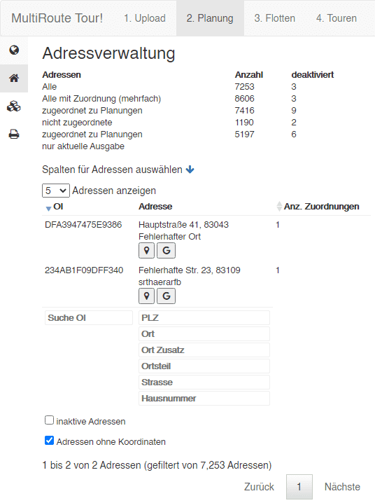

3) In Google Maps klicken Sie mit der rechten Maustaste auf den Punkt, wo Ihre Adresse liegt und kopieren sich mit einem Rechtsklick die Koordinate in den Zwischenspeicher.

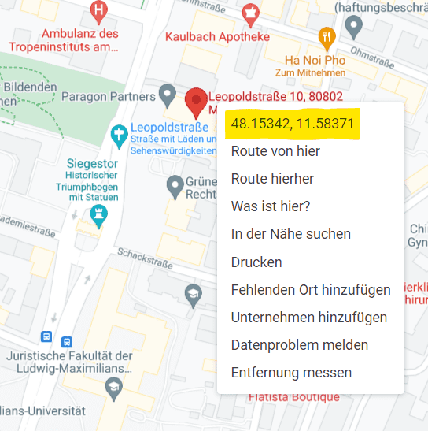

4) In MRT! klicken Sie in der Spalte "OI" auf die entsprechende Adresse. Ein kleines Fenster öffnet sich, wo Sie nun die Koordinate mit STRG+V einfügen. Klicken Sie auf OK. Fertig! Die Koordinate ist nun für die Adresse übernommen worden. 

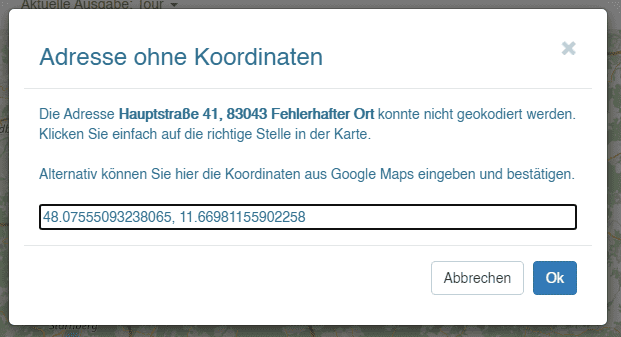

 

## Adressen korrigieren über die Karte

Wenn es beim Hochladen Ihrer Datei Adressen gab, für die keine Koordinate gefunden werden konnte, gibt es zwei Möglichkeiten diese zu korrigieren. 

- Am besten ist es, wenn Sie die entsprechenden Adressen überprüfen. Eine einfache Google-Suche offenbart bereits schon, wo der Fehler lag. In diesem Falle korrigieren Sie die Adresse am besten gleich in Ihrem CRM, sodass in Zukunft die richtige Adresse exportiert wird. 

- Können Sie keinen Fehler feststellen oder möchten Sie die Adresse nicht abändern, können Sie diese auch einfach in MultiRoute Tour! einmalig korrigieren. Bei weiteren Uploads wird dann immer die von Ihnen gesetzte Koordinate für die entsprechende Adresse verwendet. 

Hierzu gehen Sie wie folgt vor:

1) Lassen Sie sich alle nicht gefundenen Adressen in der Adressverwaltung unter **2.Planung -> Adressverwaltung (kleines Ordnersymbol)** und einem Klick auf die Checkbox **"Adressen ohne Koordinaten"** anzeigen.

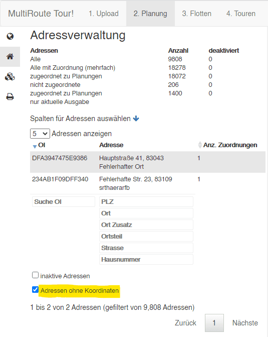

2) Suchen Sie die Adresse auf Google Maps und klicken Sie mit der rechten Maustaste auf das Gebäude bzw. die Adresse, für die Sie die Koordinate in MRT! übernehmen möchten. Kopieren Sie die Koordinate mit einem Klick in Ihren Zwischenspeicher.

Kartendaten © 2021 COWI,GeoBasis-DE/BKG (©2009),Google

3) Klicken Sie in MRT! auf die Adresse, die Sie korrigieren möchten. Es öffnet sich ein Korrekturfenster. Bestätigen Sie.

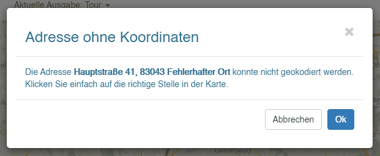

4) Klicken Sie mit dem Fadenkreuz in die Karte. Hier können Sie nun entweder manuell die Adresse in der Karte suchen oder Sie kopieren die Koordinaten in das Eingabefenster. Zuerst die kleinere (Longitude), dann die größere Zahl (Latitude).

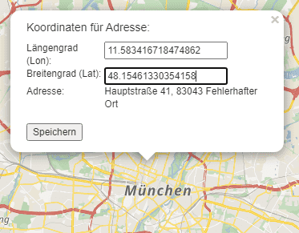

5) Speichern Sie. Die Adresse ist nun auch für weitere Uploads an der richtigen Koordinate gespeichert. 

 

## Planungen löschen 

Möchten Sie Planungen in MRT! löschen, klicken Sie auf **Administration -> Planung**. 

Hier wählen Sie die Planungen aus, die Sie löschen möchten und klicken auf "Anwenden" (gelb markiert).

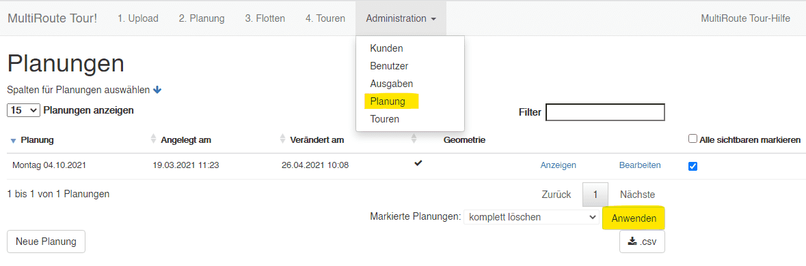

 

## Planungen manuell zerteilen (Schere)

Sie können in MRT! Ihre Planungen manuell in der Karte zerteilen. 

1) Erzeugen Sie hierzu nach dem Upload zunächst unter **2. Planung** ein Polygon mit dem kleinen Zauberstab. 

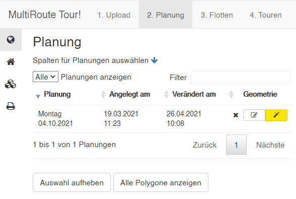

2) Es wird ein blaues Polygon erzeugt, dass Ihnen die räumliche Verteilung Ihrer Aufträge zeigt. Dieses können Sie nun zerschneiden. Hierzu klicken Sie in das blaue Polygon woraufhin sich ein kleines Popup öffnet. Hier klicken Sie auf die kleine Schere.

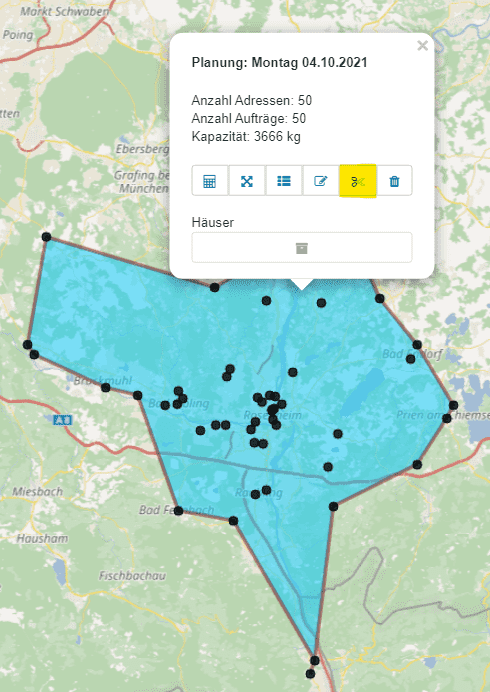

3) Starten Sie den Schnitt mit einem Klick (linke Maustaste) außerhalb des Polygons. Anschließend können Sie mit weiteren Klicks die Schnittlinie zeichnen und mit einem Doppelklick außerhalb des Polygons abschließen.

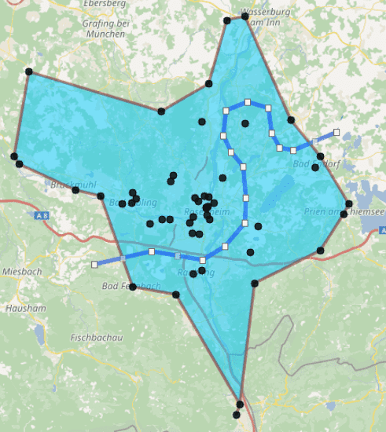

4) Geben Sie den zwei neuen Planungen nun verschiedene Namen, bspw. "Teil 1" & "Teil 2" und speichern Sie im Anschluss mit Klick auf die Diskette (links im Bild, gelb markiert).

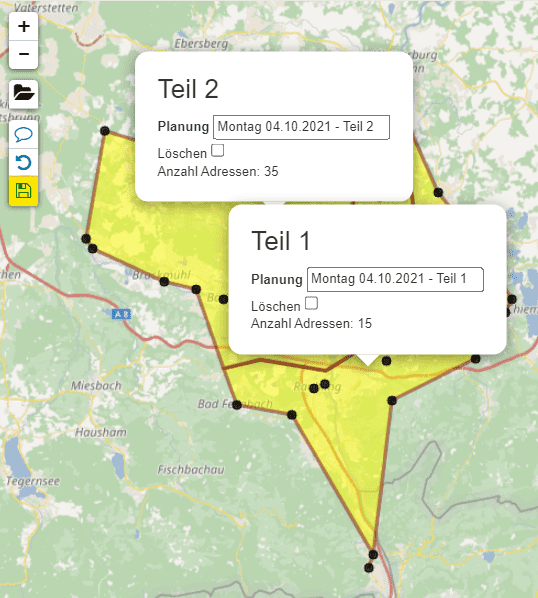

5) Fertig. Sie haben nun aus einer Planung zwei Planungen erzeugt. 

 

## Planungen vereinigen 

Über die Karte können Sie zwei Planungen leicht vereinigen. 

1) Erzeugen Sie unter **2. Planung** für alle Planungen mit dem Zauberstab blaue Polygone (Spalte Geometrie).

2) Klicken Sie eine Planung in der linken Sidebar an. Diese wird nun blau wohingegen die nicht ausgewählten Polygone rot erscheinen.

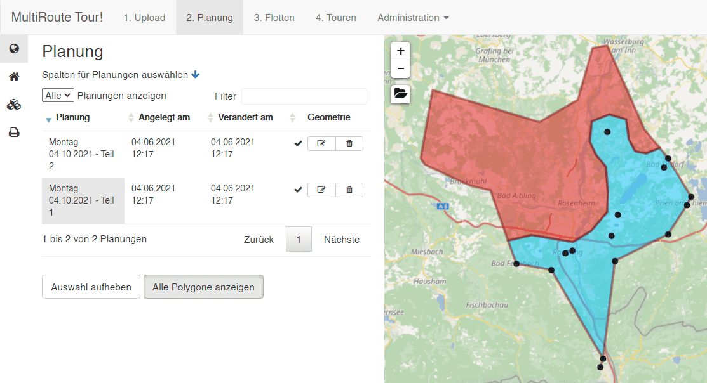

3) Klicken Sie nun in das rote Polygon und anschließend auf das Vereinigen-Symbol (gelb markiert). Es wird immer die rote Planung der blauen hinzugefügt.

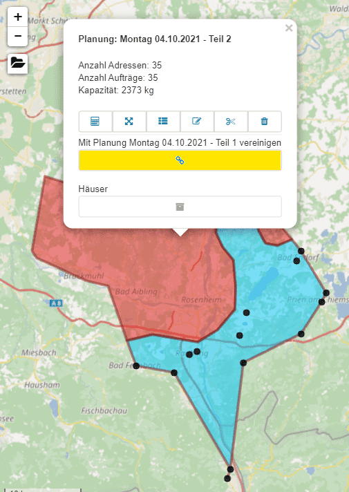

4) Fertig. Die Aufträge aus der roten Planung sind nun der blauen Planung hinzugefügt. 

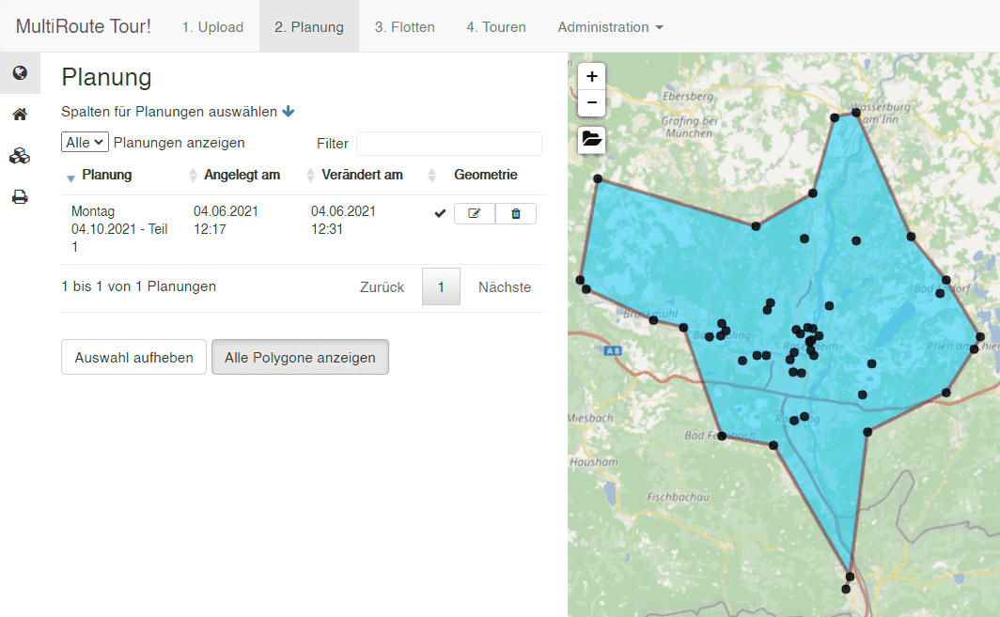

Möchten Sie den Namen der Planung ändern, klicken Sie auf **Adminstration -> Planung -> bearbeiten -> *Namen ändern* -> speichern**.

 

## Kartenebenen an- und ausschalten 

In der Karte finden Sie oben rechts die sogenannte Layersteuerung. Hier können Sie mit der Maus einzelne Kartenebenen an- und ausschalten. 

Wenn Sie auf das Fragezeichen und anschließend in die Karte klicken, können Sie sich zusätzlich die Postleitzahl und Ort für einen beliebigen Punkt anzeigen lassen. 

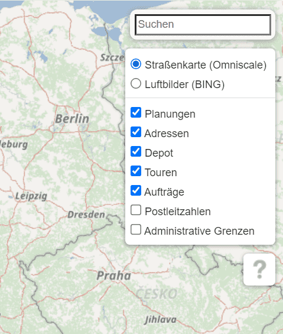

 

## Strecken bei der nächsten Berechnung beibehalten

Möchten Sie Ihre Strecken "einfrieren" und nur wenige Aufträge hinzufügen/ändern/entfernen? 
Hierfür gibt es eine spezielle Funktion, die eben diese **Aufteilung der Aufträge auf die Strecken** bei den nächsten Berechnungen für Sie beibehält. 

Dies funktioniert über die sogenannte **Streckenzuordnung**, die in der Flotte auch schlicht mit der Raute (**#**) abgekürzt wird.

Gehen Sie zur Nutzung wie folgt vor:

1. In Ihrer Flotte erhält jedes Fahrzeug eine eigene **Streckenzuordnung**snummer. Hier 1-4. 

    

2. Laden Sie eine Planung ganz normal hoch, mit allen Parametern, die Sie sonst auch benutzen.

    

3. Berechnen Sie die Ausgangstour, die später "eingefroren" werden soll.

    

    In diesem Beispiel gibt es bspw. vier verschiedene Strecken, die fast exklusiv gewisse Gebiete zugewiesen bekommen haben. Weil sich die Strecken nicht überschneiden und auf Kundenbindung (gleicher Fahrer kommt immer beim gleichen Kunden vorbei) Wert legen, entscheiden Sie sich diese Tour "einzufrieren". 

4. Tour einfrieren und Strecken beibehalten

    Wählen Sie alle Strecken, die Sie beibehalten möchten unten rechts mit den Checkboxen aus. 

    Wenn Sie von diesen Strecken ggf. doch nur **Alex** und **Lisa** beibehalten und die restlichen Aufträge noch einmal neu verteilen möchten, aktivieren Sie nur diese Strecken auf der Karte. Wenn Sie alle beibehalten möchten, aktivieren Sie alle mit **Alle anzeigen**.

    

    In diesem Beispiel sollen also nur die Aufträge von **Alex** und **Lisa** beibehalten werden. 

    Klicken Sie nun auf das kleine blaue Bookmark-Icon [:material-bookmark:]() und bestätigen Sie. 

    

    

5. Neue Tour mit bestehenden Zuordnunen berechnen

    Wenn Sie nun Aufträge verändern, wird die Zuordnung der Aufträge von **Alex** und **Lisa** bei neuen Tourberechnungen automatisch beibehalten. Beide können aber noch Aufträge dazubekommen, falls die Optimierung es erlaubt. 

    Wenn Sie noch einmal neu "würfeln" möchten und die **Streckenzuordnungen** komplett ignorieren möchten, können Sie diese einfach bei der nächsten Tourberechnungn ignorieren. 

    

!!! warning "Achtung!"

    Da die Streckenzuordnungsnummern an den Aufträgen immer überschrieben werden, können Sie dies nicht rückgängig machen. Wir empfehlen, eine separate Datei zum Testen hochzuladen und mit dieser Planung zu experimentieren, bevor Sie das Feature für Ihre echte Planung benutzen. 

 

## Import in Google Maps mit MyMaps

### Export-Formate

Unsere [Export-Formate](../tour/#tour-exportieren), wie bspw. der [Google-Maps-Export](https://tour.multiroute.de/google_maps?token=9C278CAECFE8C38CC7D82C26FADDFE06659BB20461FDD7F6FDADD0373EECC1E87CCFD70D623E7217E44031895C591BF37C23BA6F74AB8B5479DCBD45ACC4E58B) sowie unsere [Klick-Maps](https://tour.multiroute.de/klick_tour?token=9C278CAECFE8C38CC7D82C26FADDFE0680100C06D22D0401A0BA9BCC118CF3552893F1FBD92AF3F89846B5AD707C30477CE9A167C20315962CAF98022ECD3AEE) wurden dazu konzipiert, Änderungen schnell an Fahrer übermitteln zu können.

Wenn Sie mit sehr statischen Touren arbeiten und diese nur äußerst selten anpassen, kann es nützlich sein, sich die Touren in Google Maps *direkt* zu speichern, sodass man diese immer dabei hat. 

Das, was Sie auf unserer [Klick-Map](https://tour.multiroute.de/klick_tour?token=9C278CAECFE8C38CC7D82C26FADDFE0680100C06D22D0401A0BA9BCC118CF3552893F1FBD92AF3F89846B5AD707C30477CE9A167C20315962CAF98022ECD3AEE) sehen, können Sie nämlich in ähnlicher Form auch in Google Maps abbilden, sodass Sie beim Navigieren im Fahrzeug nie den Überblick verlieren wo der nächste Auftrag liegt. 

### My Maps

[My Maps](https://www.google.com/maps/d/u/0/?hl=de) ist eine Plattform von Google, die es ermöglicht teilbare Karten für Google Maps zu generieren.

Eine Karte für komplette Tour mit bspw. 4 Fahrzeugstrecken könnte bspw. so aussehen.

Wenn Sie navigieren, sehen Sie immer alle Aufträge, hier im Bild bspw. die gelben Pinnadeln 4, 5 und 6. 

Testen Sie die Kartenansicht gerne mit unser [Beispielkarte für den Raum Berlin](https://www.google.com/maps/d/u/0/edit?mid=1LYUyCPCSPzVjpQN1FOiPTf_aQ_NAJZc&usp=sharing)

### MultiRoute Tour! Excel-Export in My Maps einlesen und teilen 
1. Exportieren Sie sich die Excelliste für eine Tour Ihrer Wahl.

2. Da Google My Maps Adressen aus einer Spalte beziehen muss, erzeugen Sie mit einer einfachen Formel eine neue Spalte in Excel "Adresse". Die Formel hierzu lautet `=TEXTVERKETTEN(" ";WAHR;F2:I2)` für die im Bild angegebene Zelle. Danach übernehmen Sie diese Formel für weiteren Zellen mit einem Doppelklick auf den grünen Punkt in der unteren rechten Ecke.

Die Tabelle sollte nun so aussehen. Speichern Sie.

3. Öffnen Sie [My Maps](https://www.google.com/maps/d/u/0/?hl=de) und loggen Sie sich in Ihren Google Account ein. Legen Sie eine neue Karte an und vergeben Sie einen Namen. 

4. Links in der Übersicht finden Sie die Option eine Datei hochzuladen. Klicken Sie auf **importieren**. 

5. Ziehen Sie die Datei in das Fenster und lassen Sie los.

6. Wählen Sie hier die soeben angelegte Spalte **Adresse** aus.

7. Im nächsten Schritt wählen Sie **Fz.Str.** aus. Schließen Sie den Export ab.

8. Auf der Karte erscheinen nun alle Pinnadeln in der gleichen Farbe. 

Um diese nach den Strecken einzufärben klicken Sie links in der Übersicht auf **einheitlicher Stil** um diesen anzupassen.

Wählen Sie wie im Bild zweimal **Fz.Str.** aus, um hiernach einzufärben und die Label anzuzeigen.

Fertig!

9. Klicken Sie nun auf **Teilen** um die Karte mit Kollegen zu teilen oder bei Ihnen auf dem Handy anzuzeigen.

Mit diesen Einstellungen kann jeder, der den Link hat, die Karte aufrufen.

Verschicken Sie den Link an alle, die ihn benötigen.

Wenn jemand den Link mit Google Maps auf dem Handy aufruft, können alle Aufträge betrachtet werden. Mit einem Klick auf den enstprechenden Auftrag kann in der App sofort losnavigiert werden. 

