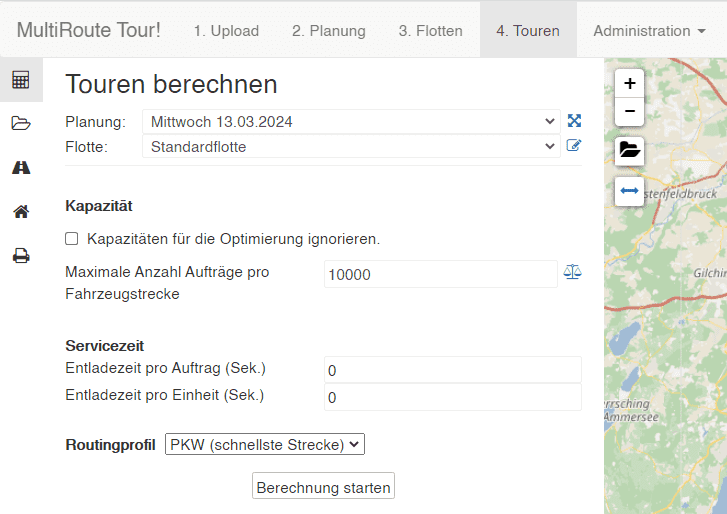
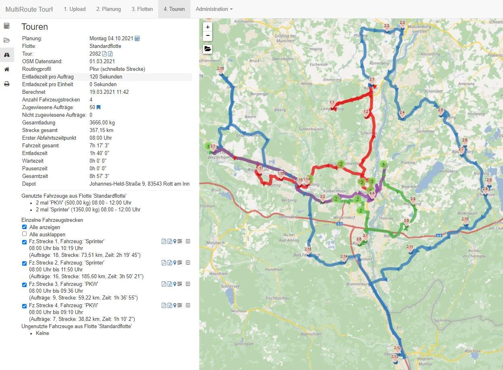
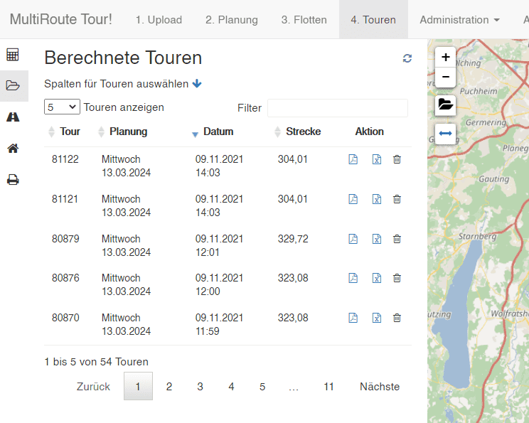
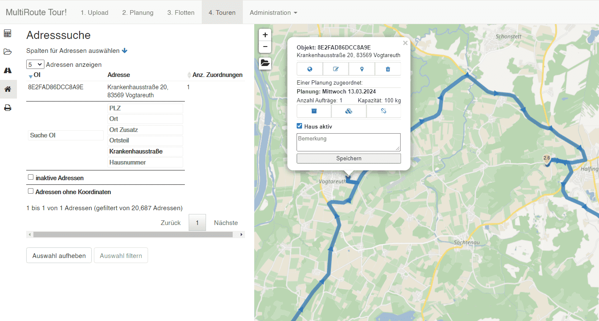

# 4. Touren

Unter **Touren** können Sie Touren optimieren und bereits berechnete Touren anzeigen lassen. 

## Tour berechnen

Zum Berechnen wählen Sie nun einmal die Planung (Mittwoch 13.03.2024) und die Flotte (Standardflotte) aus, mit denen Sie eine Tour optimieren möchten. 

Sie haben hier die Option noch weitere Parameter einzugeben, wie die Servicezeit oder das Routingprofil (PKW oder verschiedene LKW-Klassen). Ein Klick auf die kleine Waage lastet Ihre Fahrzeuge so gleich aus wie möglich. Mit "Berechnung starten" wird die Tour nun innerhalb von wenigen Sekunden berechnet.

## Tour anzeigen

Klicken Sie auf das Ergebnis. Ihnen werden die berechneten Strecken und alle statistischen Informationen zur Tour angezeigt. 

In der Sidebar links können Sie mit einem Klick auf das Ordnersymbol alle bisher berechneten Touren anzeigen lassen.

## Adresse in Touren suchen 

Mit einem Klick auf die Adressuche (Haussymbol) können Sie in den Touren Ihre eingelesenen Adressen suchen. 

## Aktuellen Kartenausschnitt drucken

Ein Klick auf den Drucker erzeugt einen druckbaren 💾 [PDF-Export](../assets/downloads/Kartendruck.pdf), den Sie sich ausdrucken können.

## Tour exportieren

Mit den Icons können Sie sich die Gesamttour oder die Einzelstrecken als interaktive Karte, PDF, Excel, gpx oder im Google-Maps-Format exportieren.

### Google Maps Export

Für das PKW-Routing bieten wir den bequemen Google und Apple Maps Export für Ihr Handy an.

Klicken Sie <a href="https://tour.multiroute.de/google_maps?token=9C278CAECFE8C38CC7D82C26FADDFE06659BB20461FDD7F6FDADD0373EECC1E87CCFD70D623E7217E44031895C591BF37C23BA6F74AB8B5479DCBD45ACC4E58B" rel="nofollow noindex">hier</a> für die Beispielliste.

### Interaktive Karte

Klicken Sie 🗺️ <a href="https://tour.multiroute.de/klick_tour?token=9C278CAECFE8C38CC7D82C26FADDFE0680100C06D22D0401A0BA9BCC118CF3552893F1FBD92AF3F89846B5AD707C30477CE9A167C20315962CAF98022ECD3AEE" rel="nofollow noindex">hier</a> für die interaktive Karte oder scannen Sie den QR-Code mit dem Handy.

.

### Excel, PDF, GPX

Klicken Sie zum Download für den 💾 [Excel-Export](../assets/downloads/Tourexport.xlsx) und den 💾 [PDF-Export](../assets/downloads/Tourexport.pdf) für alle Strecken. Wir bieten ebenfalls das GPX-Format an.
