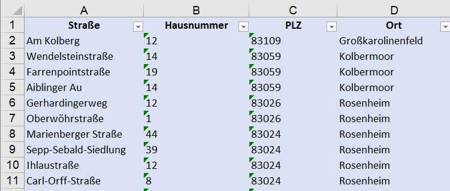
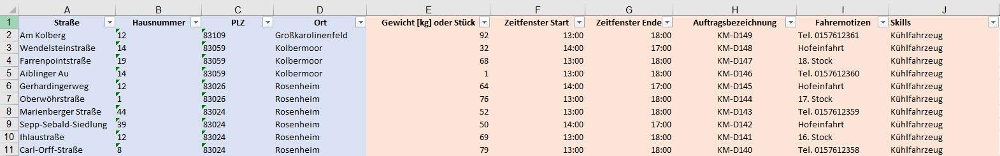
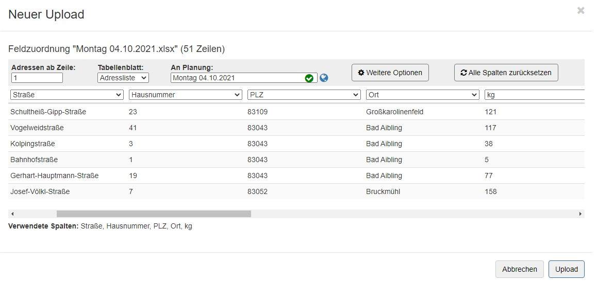

# **1. Upload**

Musterdateien zum Download: 

- 💾 [Musterliste](assets/downloads/Muster-Upload.xlsx)
- 💾 [Musterliste mit allen optionalen Spalten](assets/downloads/Muster-Upload-erweitert.xlsx)

## Einfachste Variante

In MultiRoute Tour! können Sie Exceltabellen oder csv-Dateien (mit beliebigem Trennzeichen) hochladen. 
Für den einfachsten Fall benötigen Sie nur eine Tabelle mit Adressinformationen. In diesem Muster sind bspw. vier Spalten enthalten mit Straße, Hausnummer, PLZ, Ort. Sie können Straße und Hausnummer aber auch direkt in eine Spalte schreiben. Selbiges gilt für PLZ und Ort. Falls vorhanden können Sie ebenfalls noch eine zusätzliche Spalte für Hausnummernzusatz oder Ortszusätze hinzufügen. Wenn Sie mit Koordinaten arbeiten, können Sie diese ebenfalls hochladen.

💾 [Musterliste](assets/downloads/Muster-Upload.xlsx)

## Zusätzliche optionale Spalten

Die notwendigen Spalten sind blau markiert, die optionalen orange. 

Neben einem Gewicht oder eine Stückzahl, können Sie ein oder mehrere Auftragszeitfenster festlegen. Diese können die Öffnungszeit(en) Ihres Kunden widerspiegeln. Sie können ebenfalls eine Auftragsbezeichnung und Notizen vergeben, die auf den Export-Dokumenten nach der Tourenberechnung wieder auftauchen. 

Mithilfe der Skills können Sie Besonderheiten abbilden, wenn ein Auftrag bspw. ein Kühlfahrzeug benötigt, sie aber eine heterogene Flotte von "normalen" Fahrzeugen und Kühlfahrezugen haben. Diese Skills werden ebenfalls in der Flotte eingegeben und den oder dem entsprechenden Fahrzeug(en) zugeordnet. 

💾 [Musterliste mit allen optionalen Spalten](assets/downloads/Muster-Upload-erweitert.xlsx)

## Spaltenerklärung

### Adressinformationen und Koordinaten

Die räumliche Information zu Ihren Aufträgen bildet die Grundlage für jede Optimierung. Diese kann in zwei verschiedenen Formen übergeben werden: als Adresse oder als Koordinate. 

Das Gros unserer unserer Kunden übermittelt uns lediglich die Adressinfos zu denen in MRT! anschließend automatisch die Koordinaten gesucht werden. Falls Sie diese bereits vorliegen haben - umso besser! Sie können in diesem Fall entweder nur die Koordinaten hochladen oder ebenfalls Adressinfos.

|Spalte|Erklärung|Beispiel|
|---|---|---|
|**Adressinfos**|||
|Straße|Straßenname|Unter den Linden|
|Hausnummer|Hausnummer mit oder ohne Zusatz|5 oder 5a|
|Hausnummernzusatz|Nur Zusatz ohne eigentliche Hausnummer|a|
|PLZ|Postleitzahl|80101|
|Ort|Ortsangabe mit oder ohne Zusatz|Köln oder Köln-Kalk|
|Ortszusatz|Nur Zusatz ohne eigentlichen Ort|Kalk|
||||
|**Koordinaten**|||
|Latitude|Breitengrad|45.213552|
|Longitude|Längengrad|8.9234352|

### Auftragsinformationen

Aufträge beinhalten gewisse notwendige Angaben Kunden oder können eine Vielzahl von komplexen Bedingungen aufweisen. 

|Spalte|Erklärung|Beispiel|
|---|---|---|
|**Einfache Textangaben**|||
|Auftragsbezeichnung|Hiernach lässt sich in MRT suchen und filtern|Auftrag B-5132|
|Fahrernotizen|Etwaige Textinformationen, die für den Auftrag Belang haben. Spalte kann im Upload mehrmals vergeben werden|Achtung Hund!|
||||
|**Einfache Bedingungen**|||
|Kapazität|Liefermenge in kg, Stück, oder Personen|10|
|Servicezeit|Individuelle Zeit, die am Auftragsort verbracht wird in Sekunden|60|
|Auftragszeitfenster Start|Startzeit eines Zeitfensters innerhalb dessen der Auftrag erledigt werden kann|08:00|
|Start am nächsten Tag (ja/nein)|Wenn der Zeitpunkt nicht auf den Ausgangstag sondern den Folgetag fällt, muss dies mit **ja** gekennzeichnet werden|nein| 
|Auftragszeitfenster Ende|Endzeit eines Zeitfensters innerhalb dessen der Auftrag erledigt werden kann|14:00|
|Ende am nächsten Tag (ja/nein)|Wenn der Zeitpunkt nicht auf den Ausgangstag sondern den Folgetag fällt, muss dies mit **ja** gekennzeichnet werden|ja| 
||||
|**Profi-Bedingungen**|||
|Skills|Zuordnung eines Auftrages zu einem Fahrzeug damit besondere Fahrer- oder Fahrzeuganforderungen für diesen Auftrag abgebildet werden können, wenn bspw. Ware für diesen Auftrag (aber für andere nicht) gekühlt werden muss. Es können auch mehrere Skills angeben und kombiniert werden (kommagetrennt). In der Flotte erhält jedes Fahrzeug dann den entsprechenden Skill. Skills sind UND-Bedingungen, d.h. ein Fahrzeug muss immer alle Auftrags-Skills erfüllen, damit der Auftrag erledigt werden kann.|Kühlfahrzeug, Gabelstapler|
|Streckenzuordnung|Ähnlich der Skills, mit dem Unterschied, dass hier eine ODER-Bedingung gilt, d.h. wenn bspw. jedes Fahrzeug eine eigene Nummer hat, können am Auftrag mehrere Fahrzeugnummern angegeben werden (kommagetrennt), die den Auftrag erledigen dürfen.|3,5,9|
|Priorität|Dient der Priorisierung von einzelnen Aufträgen über andere, wenn nicht alle erledigt werden können. Wichtige Aufträge erhalten eine 1 und Aufträge, die nur erledigt werden sollen, wenn alle wichtigen Aufträge verplant wurden eine 0.| 1 |

???+ Hinweis zu "Start/Ende am nächsten Tag (ja/nein)"

	MultiRoute Tour! geht per Default davon aus, dass alle Ihre Aufträge am gleichen Kalendertag bearbeitet werden. 
	Wenn Sie Aufträge in der Nacht erledigen oder Sie generell in längeren Schichten arbeiten, müssen Sie dies entsprechend kennzeichnen.
	Bsp.: Ein Auftrag kann zwischen 22:00 Uhr und 02:00 des Folgetages erledigt werden. 22:00 Uhr bezieht sich hierbei auf den Ausgangstag (Default). 
	In diesem Fall kann die Zelle entweder leer gelassen oder mit einem "nein" gekennzeichnet werden.
	02:00 Uhr hingegen meint den Folgetag und muss entsprechend mit "ja" gekennzeichnet werden.
 

Kontaktieren Sie uns gerne, wenn Sie eine besonders komplizierte Anforderung haben. Wir freuen uns über Ihre Anfrage!

|Vertrieb|Technischer Support|
|---|---|
|**Alina Erke [alina.erke@gbconsite.de](mailto:alina.erke@gbconsite.de) Telefon: +49 89 / 309 052 975**|**Dominik Weckmüller [dominik.weckmueller@gbconsite.de](mailto:dominik.weckmueller@gbconsite.de) Telefon: +49 89 / 309 052 974**|

## Upload in MultiRoute Tour!

In MultiRoute Tour! klicken Sie auf **1. Upload** und wählen Ihre Datei aus. Anschließend müssen Sie die Spalten Ihrer Datei auswählen, die von MultiRoute Tour! berücksichtigt werden sollen. 
Der Dateiname wird standardmäßig als Planungsbezeichnung genommen. Diese können Sie im Feld "An Planung" manuell nach Belieben anpassen, bspw. zu "Montag 04.10.2021".

