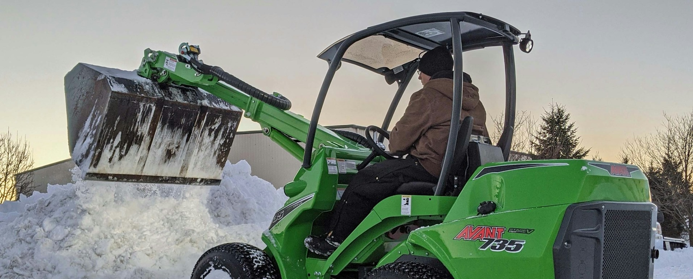

# Winterdienst: Effiziente Routenplanung im Winter

Foto von <a href="https://unsplash.com/de/@eliasnull?utm_content=creditCopyText&utm_medium=referral&utm_source=unsplash">Elias Null</a> auf <a href="https://unsplash.com/de/fotos/gruner-und-schwarzer-john-deere-fahrt-mit-rasenmahern-auf-schneebedecktem-boden-tagsuber-Pz2x7wzV0jM?utm_content=creditCopyText&utm_medium=referral&utm_source=unsplash">Unsplash</a>

## Szenario: Herausforderungen im Winterdienst

Winterdienste spielen eine entscheidende Rolle, wenn es darum geht, Straßen, Gehwege und Innenhöfe von Eis und Schnee zu befreien. Hierbei kommen verschiedene Räumfahrzeuge zum Einsatz: große **Schneeschiebe-SUVs** für breite Fahrbahnen und kleine wendige **Traktoren** für enge Gehwege.

Oftmals erfordert die Räumung auch spezifische Standorte, wie Bushaltestellen ohne direkte Adresse oder Hinterhöfe. Hier kommt die präzise Routenplanung durch exakte Koordinaten ins Spiel. Da die Arbeit oft in den frühen Morgenstunden erledigt werden muss, ist eine effiziente Routenplanung von größter Bedeutung.

## MultiRoute Tour!: Die Lösung für Ihre Routenplanung

Mit **MultiRoute Tour!** können Sie Ihre Routenplanung perfekt optimieren, indem Sie verschiedene Anforderungen der Kunden mithilfe von **Skills** abbilden. Diese Skills ermöglichen es, die spezifischen Bedürfnisse jedes Auftrags zu erfassen, wie beispielsweise:

| Skill   | Bedeutung                                                 |
|---------|------------------------------------------------------------|
| **SUV** | großer Schneeschieber, ganze Fahrbahn räumen              |
| **Traktor** | Gehweg räumen                                           |

Diese Skills werden in Ihrer Exceltabelle hinterlegt, die beispielsweise so aussehen könnte:

|...|Straße Hausnummer|PLZ|Ort|Skill|Räumzeit in Sekunden|
|---|-----------------|---|---|-----|-------------------|
|...|Hauptstraße 10|21614|Buxtehude|SUV|30|
|...|Bahnhofsweg 11|21614|Buxtehude|Traktor|60|
|...|Amselgasse 20|21614|Buxtehude|SUV|30|
|...|...|...|...|...|...|

Die **Räumzeit** kann individuell festgelegt oder pauschal für alle Aufträge festgesetzt werden. Für Adressen, die sowohl Gehwege als auch Straßen räumen lassen, müssen separate Zeilen erstellt werden:

|...|Straße Hausnummer|PLZ|Ort|Skill|Räumzeit in Sekunden|
|---|-----------------|---|---|-----|-------------------|
|...|Hauptstraße 10|21614|Buxtehude|SUV|30|
|...|Hauptstraße 10|21614|Buxtehude|Traktor|60|
|...|...|...|...|...|...|

Anschließend geben Sie in Ihrer Flottenübersicht die Anzahl Ihrer Traktoren und SUVs an und können die Touren optimal berechnen lassen. Die Fahrer erhalten den [Google-Maps-Export](../tour/#tour-exportieren) und können direkt loslegen.

---

