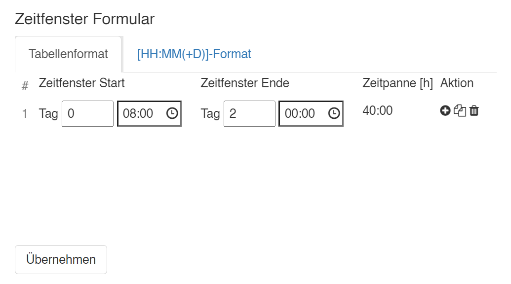
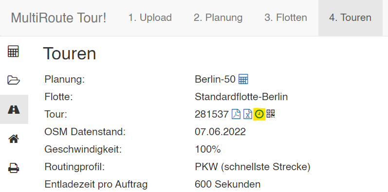
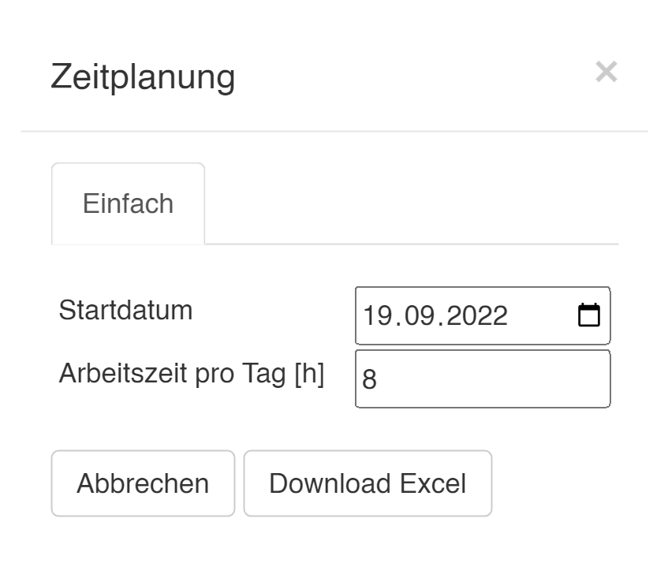
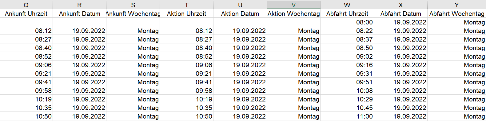

# Wochenplanung

Photo by <a href="https://unsplash.com/de/@towfiqu999999">Towfiqu barbhuiya</a> on <a href="https://unsplash.com/de/fotos/einen-kalender-mit-daran-angehefteten-roten-druckknopfen-bwOAixLG0uc">Unsplash</a>

## Anforderung 
Wenn Sie Ihre Fahrzeuge nicht nur auf einfache Tagestouren schicken, bei denen das Fahrzeug immer wieder am gleichen Tag zurück zum Depot oder nach Hause fährt, sondern die Fahrzeuge bspw. *eine ganze Woche am Stück* mit Übernachtungen unterwegs sein sollen, kann dies ganz einfach in MRT! abgebildet werden. 

Um anstatt einer einfachen Tagestour eine Wochentour abzubilden, befolgen Sie diese zwei Schritte.

## 1. Wochenarbeitszeit des Fahrzeugs definieren 

In der Flotte geben Sie bei den entsprechenden Fahrzeugen bei der Einsatzzeit zunächst die gewünschte Startzeit am Montagmorgen ein, bspw. 8 Uhr. 

Danach passen Sie die Endzeit so an, dass bei der **Zeitspanne** die gewünschte Wochenarbeitszeit herauskommt, also bspw:

**5 Wochentage * 8 Stunden/Tag = 40 Wochenarbeitsstunden**

Diese Endzeit hat keinerlei Bedeutung für die Tourenplanung und dient nur dazu, die Wochenarbeitszeit zu definieren. 

Rechnung: Von **Tag 0 | 08:00 Uhr** zu **Tag 2 | 00:00 Uhr** sind es genau 40h, die später genau auf die einzelnen Wochentage aufgeteilt werden. 

Arbeiten Sie nur die 3 Tage in der Woche?

Kein Problem, der zweite Eingabewert würde dann **Tag 1 | 08:00 Uhr** betragen, weil Sie an **3 Tagen je 8h arbeiten** und somit auf **24h** gesamte Arbeitszeit für diese 3 Tage kommen.

## 2. Tour berechnen & Tourexport

Nun berechnen Sie wie gewohnt Ihre Touren. Beim Tourexport gibt es ein kleines Uhr-Icon zum Export der Wochenplanung. 

Wenn Sie hierauf klicken, öffnet sich ein kleines Fenster, mithilfe dessen Sie nun die präzise Wochenplanung mit Startdatum & Arbeitszeit pro Tag exportieren können. 

In der Exceltabelle sind alle Infos (Uhrzeit, Datum, Wochentag) genau zu entnehmen.

